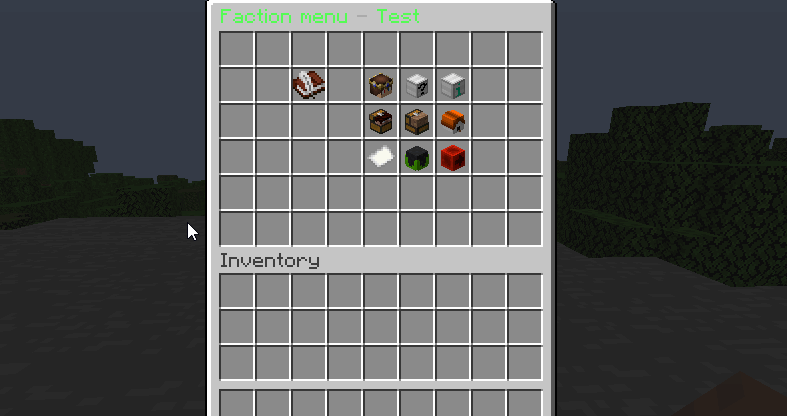
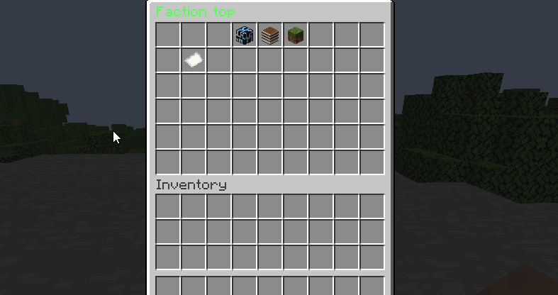
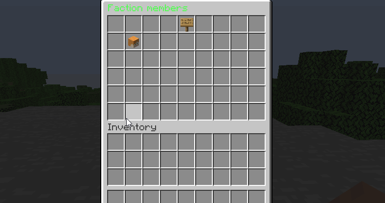
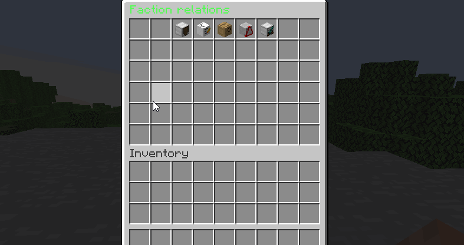
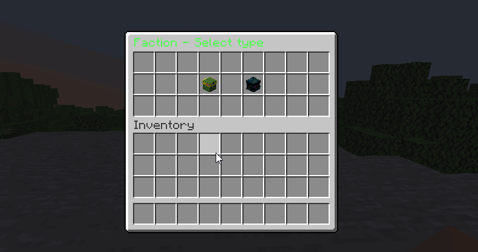
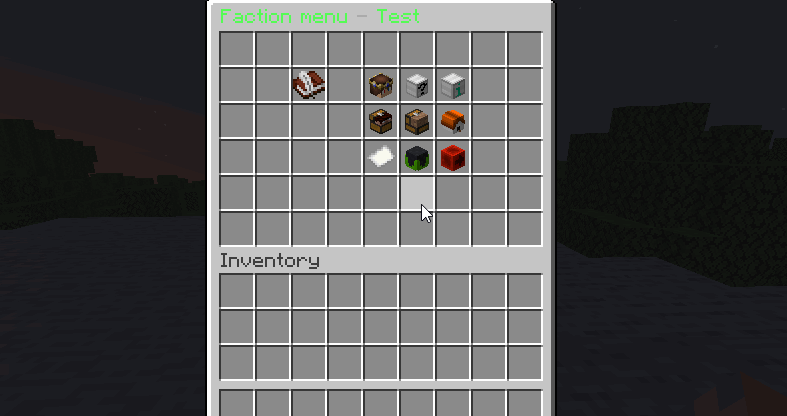
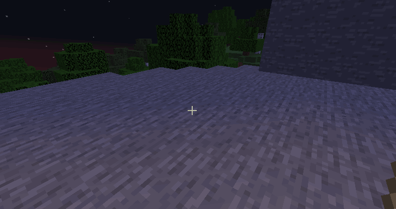
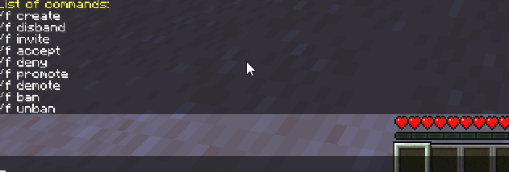

# PFactions
A faction plugin with claims per chunk, faction boss and members roles

## Images
 - Main menu: 
 - Faction menu: 
 - Top menu: 
 - Members menu: 
 - Relations menu: 
 - Type menu: 
 - Boss menu: 
 - Giant zombie boss: 
 - Spider boss: 
 - Commands: 

## Requirements
* Plugin:
    - Citizens
* Spigot 1.17+
* Java 8+